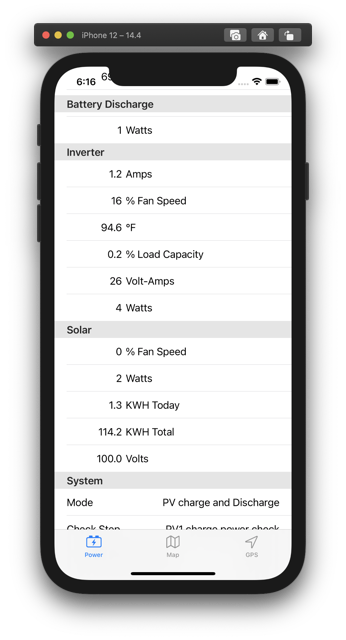
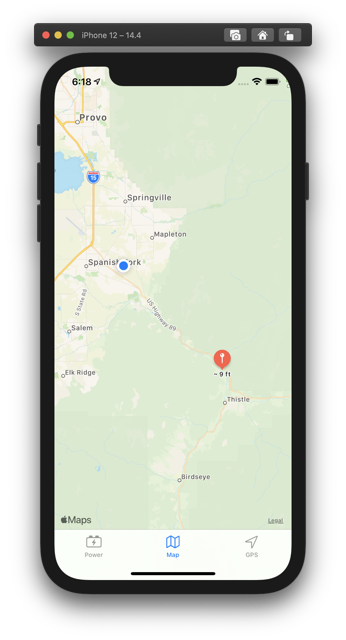
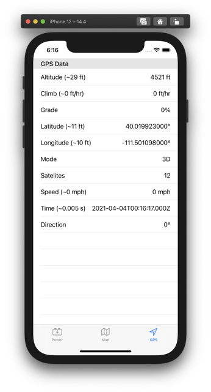

# Trailer Monitor - iOS App

A websockets client UI for my raspberry pi based trailer monitor.

The code running on the raspberry pi can be found at [https://github.com/joshgubler/trailer-monitor-rpi](https://github.com/joshgubler/trailer-monitor-rpi).

The raspberry pi websocket service is available at two locations:

* `trailer` which is the hostname the raspberry pi broadcasts on the lan
* `192.168.255.100` which is the static ip address allocated to the trailer's VPN client profile by the VPN server

The app attempts to establish a websocket connection at both of these locations. Every five seconds, the app checks the status of these two connections, and retries any connections that aren't in a `running` state. The resulting user experience is an app that connects automatically, and switches seamlessly between local and remote (over VPN) connections.

## Power Data

Real time data feed of AC, battery, inverter, solar, and overall power system health.

## Map

Real time feed of trailer (red pin) and user location (blue dot) on a map. Tapping the `Map` tab a second time re-centers the map. Tapping the pin launches Google Maps app in navigation mode, giving directions back to the trailer. (Google Maps will not track trailer location. If the trailer moves, you'll need to switch back to the monitor app and tap the red pin again.)

## GPS Data

Real time feed of speed and location data.
